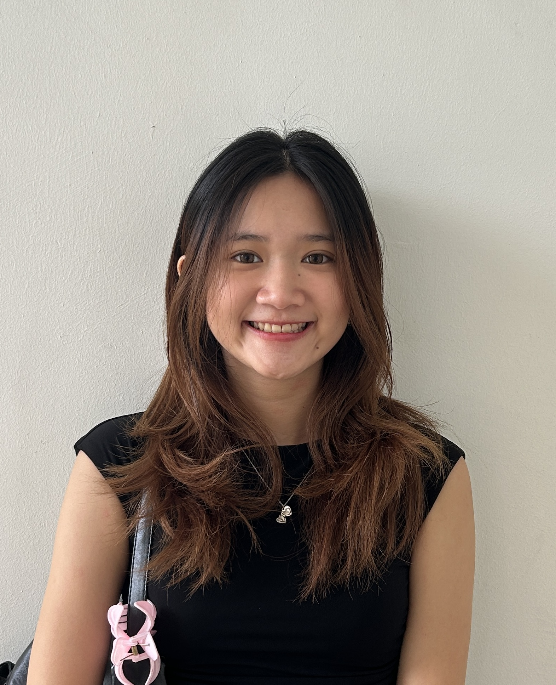
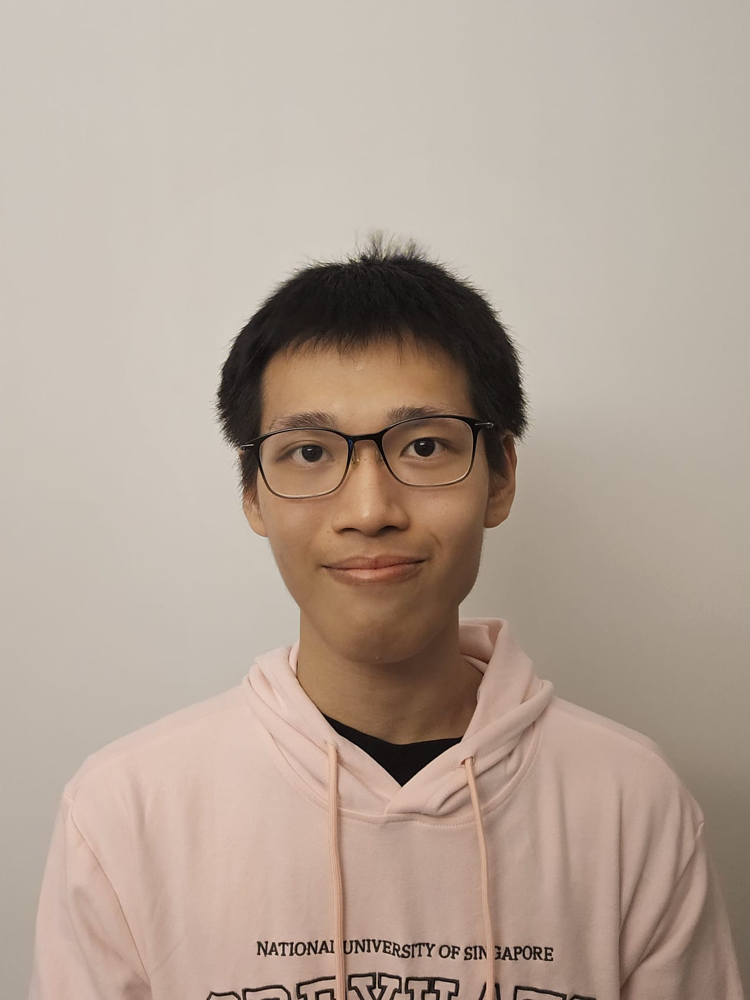

# About Us

We are a team based in the [School of Computing, National University of Singapore](http://www.comp.nus.edu.sg).

You can reach us at the email `simantak@u.nus.edu`

## Project team

### Simantak Dabahde

[[github](http://github.com/simantak-dabahde)] [[portfolio](team/simantak.md)]

* Role: Developer
* Responsibilities: Team Lead + Scheduling and Tracking

### Nguyen Ngoc Dang Khoa

[[github](https://github.com/SanguineChameleon)]
[[portfolio]](team/khoa.md)

* Role: Developer
* Responsibilities: Code Quality

### Tan Xuan Xuan Kelly

[[github](https://github.com/kellytxn)]
[[portfolio](team/kelly.md)]

* Role: Developer
* Role: Documentation + Deliverables and Deadlines

### Loh Zi Yang Cameron

[[github](http://github.com/cameronlzy)]
[[portfolio](team/cameron.md)]

* Role: Developer
* Responsibilities: Testing

### Goh Joshua

[[github](http://github.com/goh-joshua)]
[[portfolio](team/goh-joshua.md)]

* Role: Developer
* Responsibilities: Integration
