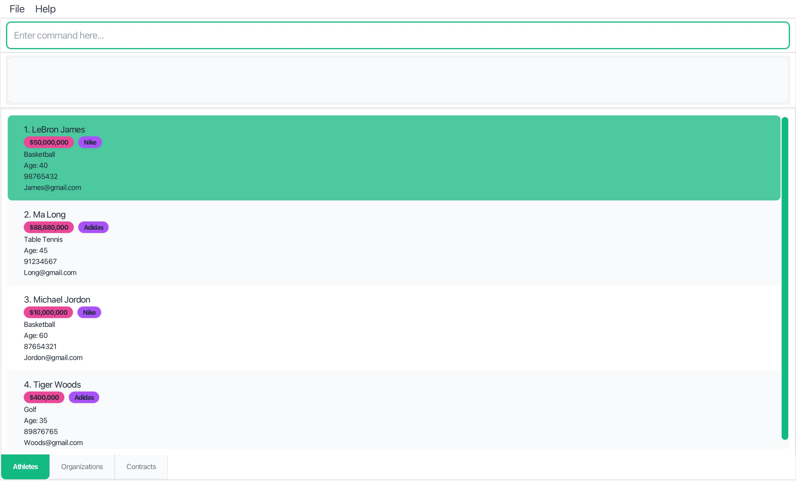
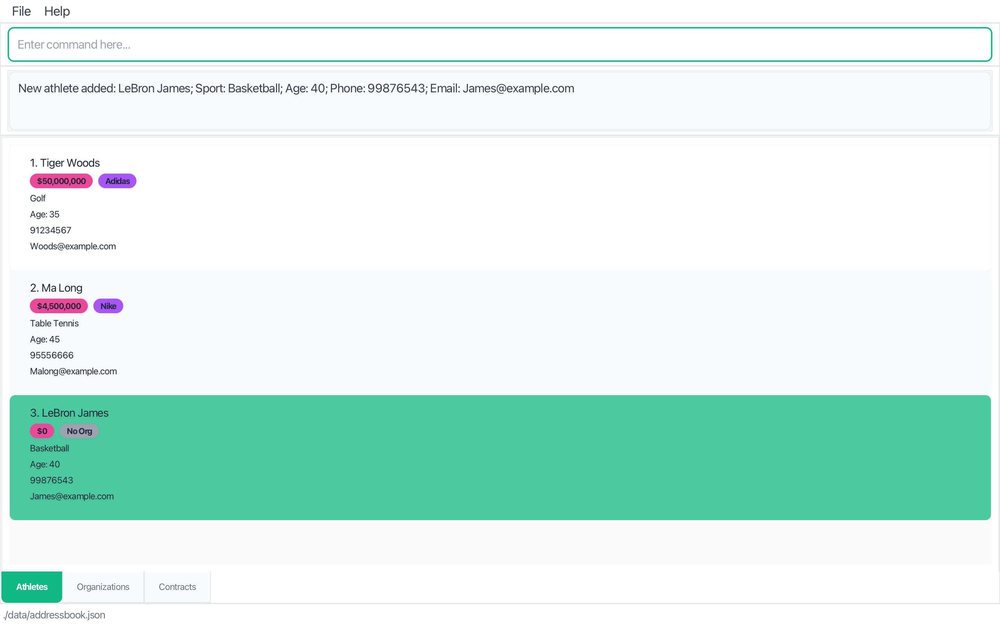

# User Guide

**playbook.io** is a platform that helps sports agents efficiently manage athletes, organizations, and contracts. It combines the speed of a Command Line Interface with the ease of a Graphical User Interface, enabling agents to stay organized, build stronger relationships, and focus on closing deals.

<!-- * Table of Contents -->
<page-nav-print />

<div style="page-break-before: always;"></div>

---

## About This Guide

### Target Users

This guide is designed for **sports agents and talent managers** operating in Singapore who:

- Manage multiple athletes across various sports
- Work with sports organizations, teams, and sponsors
- Handle contract negotiations and renewals
- Need to track relationships and opportunities efficiently
- Prefer fast, keyboard-driven workflows over mouse-heavy interfaces

<div markdown="block" class="alert alert-warning">

**⚠️ Important:** playbook.io follows Singapore conventions: phone numbers are 8-digit, contract amounts are in SGD, and dates use DDMMYYYY format.
</div>

### What You'll Need

**Prior Knowledge:**

- Basic computer literacy (file management, running applications)
- Familiarity with command-line interfaces is helpful but not required
- Understanding of sports industry terminology (contracts, agents, organizations)

**Technical Requirements:**

- Java 17 or higher installed on your computer
- 50MB of available storage space
- Any modern operating system (Windows, macOS, Linux)

### How to Use This Guide

- **New users**: Start with [Quick Start](#quick-start) for setup and basic usage
- **Existing users**: Jump to [Command Reference](#command-reference) for syntax details
- **Power users**: Check [Tips and Best Practices](#tips-and-best-practices) for advanced workflows

---

<div style="page-break-before: always;"></div>

## Quick Start

### Installation

1. **Check Java Version**

   Ensure you have Java `17` or above installed on your computer.

   ```
   java -version
   ```

   **Mac users:** Follow the setup guide [here](https://se-education.org/guides/tutorials/javaInstallationMac.html) to install the correct JDK version.  
   **Windows users:** Follow the setup guide [here](https://se-education.org/guides/tutorials/javaInstallationWindows.html) to install the correct JDK version.  
   **Linux users:** Follow the setup guide [here](https://se-education.org/guides/tutorials/javaInstallationLinux.html) to install the correct JDK version.

2. **Download playbook.io**

   Download the latest `.jar` file from the [playbook.io Releases](https://github.com/AY2526S1-CS2103T-F13-3/tp/releases) page.

3. **Set Up Home Folder**

   Copy the `.jar` file to the folder you want to use as the **home folder** for playbook.io. This is where your data files will be stored.

4. **Launch the Application**

   Open a terminal, navigate (`cd`) to that folder, and run:

   ```
   java -jar playbook.jar
   ```

   For example, if your `.jar` file is in the Downloads folder:

   ```
   cd Downloads
   java -jar playbook.jar
   ```

5. **First Look**

   The playbook.io interface should appear in a few seconds.

   

> **Note:** The screenshot above shows sample data. When you first launch the app, your screen will be blank until you add your own entries.

### Understanding the Interface

The playbook.io interface consists of five main areas:

1. **Menu Bar** (top): File and Help menus for application settings and documentation
2. **Command Box** (top area): Text input field where you type commands to interact with the application
3. **Result Pane** (top area): Displays the outcome of your commands, such as success messages, or error notifications
4. **Main Display Area** (center): Shows your data lists 
5. **Navigation Tabs** (bottom): Three tabs for switching between Athletes, Organizations, and Contracts views

**Navigation Tips:**

- Use **Cmd+1**, **Cmd+2**, **Cmd+3** (or **Ctrl+1**, **Ctrl+2**, **Ctrl+3** on Windows/Linux) to quickly switch between tabs
- Press **F1** for help or use the `help` command
- Use **Cmd+R** (or **Ctrl+R** on Windows/Linux) to refresh and clear any active search filters

### Your First Commands

Let's try some basic operations to get you started:

1. **Add an Athlete**

   ```
   add-a n/LeBron James s/Basketball a/40 p/98765432 e/james@example.com
   ```

2. **Add an Organization**

   ```
   add-o o/Nike p/98765432 e/john.doe@nike.com
   ```

3. **Search for Athletes**

   ```
   find -an LeBron
   ```

4. **Clear the Search**
   ```
   refresh
   ```

<div markdown="block" class="alert alert-info">

**💡 Tip:** All commands in playbook.io are designed to be fast to type, simple, and case-insensitive. Use short flags like `-an` (athlete name) and `-on` (organization name) to quickly find what you need.
</div>

---

## Core Features

### Managing Athletes

Athletes are the heart of your business. playbook.io makes it easy to track their information and see their contract relationships at a glance.

#### Adding Athletes

**Command:** `add-a n/NAME s/SPORT a/AGE p/PHONE e/EMAIL`

**Parameters:**

- `n/NAME`: Full name of the athlete (spaces allowed, case-insensitive; accepts alphabetic characters, hyphens, and apostrophes; must start with a letter; maximum of 50 characters, including spaces)
- `s/SPORT`: Sport of the athlete (spaces allowed, case-insensitive; alphabetic characters only; maximum of 50 characters)
- `a/AGE`: Age of the athlete (positive integers only, ranging from 1 to 99)
- `p/PHONE`: Phone number of the athlete (8-digit Singapore phone number only; must start with 6, 8, or 9)
- `e/EMAIL`: Email address of the athlete (case-insensitive; must follow standard email format; maximum of 50 characters)

<div style="page-break-before: always;"></div>

**Examples:**

```
add-a n/Lebron James s/Basketball a/40 p/99876543 e/James@example.com
add-a n/Cristiano Ronaldo s/Football a/39 p/87654321 e/cr7@example.com
add-a n/Michael Jordan s/Basketball a/61 p/95551234 e/mj@example.com
```

**Expected Output:**



```
New athlete added: Lebron James; Sport: Basketball; Age: 40; Phone: 99876543; Email: James@example.com
```

<div markdown="block" class="alert alert-warning">

**⚠️ Important:** 
- Athlete names and sports together must be unique. You cannot add two athletes with the exact same name and sport combination.  
- For athlete names and sports, spaces do not matter, so multiple consecutive spaces are treated as a single space.

</div>

#### Deleting Athletes

**Command:** `delete-a n/NAME s/SPORT`

**Parameters:**

- `n/NAME`: Full name of the athlete to delete (spaces allowed, case-insensitive; accepts alphabetic characters, hyphens, and apostrophes; must start with a letter; maximum of 50 characters, including spaces)
- `s/SPORT`: Sport of the athlete to delete (spaces allowed, case-insensitive; alphabetic characters only; maximum of 50 characters)

**Examples:**

```
delete-a n/Lebron James s/Basketball
delete-a n/Cristiano Ronaldo s/Football
delete-a n/Michael Jordan s/Basketball
```

<div style="page-break-before: always;"></div>

**Expected Output:**

```
Deleted Athlete: Lebron James; Sport: Basketball; Age: 40; Phone: 99876543; Email: James@example.com
```

<div markdown="block" class="alert alert-warning">

**⚠️ Important:**
- For athlete names and sports, spaces do not matter, so multiple consecutive spaces are treated as a single space.
- You cannot delete an athlete if they have active contracts. You must delete all associated contracts first before removing the athlete.

</div>

### Managing Organizations

Organizations include teams, sponsors, agencies, and any entity that contracts with athletes.

#### Adding Organizations

**Command:** `add-o o/ORG_NAME p/PHONE e/EMAIL`

**Parameters:**

- `o/ORG_NAME`: Name of the organization (spaces allowed, case-insensitive; accepts alphanumeric characters, hyphens, apostrophes, and ampersands; must start with a alphanumeric character; maximum of 50 characters, including spaces)
- `p/PHONE`: Phone number of the organization (8-digit Singapore phone number only; must start with 6, 8, or 9)
- `e/EMAIL`: Email address of the organization (case-insensitive; must follow standard email format; maximum of 50 characters)

**Examples:**

```
add-o o/Nike p/98765432 e/partnerships@nike.com
add-o o/Manchester United p/99998888 e/contracts@manutd.com
add-o o/IMG Academy p/88889999 e/talent@imgacad.com
```

**Expected Output:**

```
New organization added: Nike; Phone: 98765432; Email: partnerships@nike.com
```

<div markdown="block" class="alert alert-warning">

**⚠️ Important:** 
- Each organization name must be unique. You cannot add two organizations with the same name.
- For organization names, spaces do not matter, so multiple consecutive spaces are treated as a single space.

</div>

<div markdown="block" class="alert alert-info">

**💡 Tip:** Use descriptive names for organizations to easily distinguish between different types (teams, sponsors, agencies, etc.).

</div>

#### Deleting Organizations

**Command:** `delete-o o/ORG_NAME`

**Parameters:**

- `o/ORG_NAME`: Name of the organization to delete (spaces allowed, case-insensitive; accepts alphanumeric characters, hyphens, apostrophes, and ampersands; must start with a alphanumeric character; maximum of 50 characters, including spaces)

<div style="page-break-before: always;"></div>

**Examples:**

```
delete-o o/Nike
delete-o o/Manchester United
delete-o o/IMG Academy
```

**Expected Output:**

```
Deleted Organization: Nike; Phone: 98765432; Email: partnerships@nike.com
```

<div markdown="block" class="alert alert-warning">

**⚠️ Important:** 
- You cannot delete an organization if it has active contracts. You must delete all associated contracts first before removing the organization.
- For organization names, spaces do not matter, so multiple consecutive spaces are treated as a single space.

</div>

### Managing Contracts

Contracts link athletes with organizations and track the business relationships that matter most.

#### Adding Contracts

**Command:** `add-c n/NAME s/SPORT o/ORG sd/DDMMYYYY ed/DDMMYYYY am/AMOUNT`

**Parameters:**

- `n/NAME`: Athlete's full name (spaces allowed, case-insensitive; accepts alphabetic characters, hyphens, and apostrophes; must start with a letter; maximum of 50 characters, including spaces)
- `s/SPORT`: Athlete's sport (spaces allowed, case-insensitive; alphabetic characters only; maximum of 50 characters)
- `o/ORG_NAME`: Organization's name (spaces allowed, case-insensitive; accepts alphanumeric characters, hyphens, apostrophes, and ampersands; must start with a alphanumeric character; maximum of 50 characters, including spaces)
- `sd/DDMMYYYY`: Start date (must be in the DDMMYYYY format)
- `ed/DDMMYYYY`: End date (must be in the DDMMYYYY format)
- `am/AMOUNT`: Contract amount (positive integers only; supports large values up to 9,223,372,036,854,775,807; no currency symbols or commas)

**Examples:**

```
add-c n/LeBron James s/Basketball o/Nike sd/01012024 ed/01012025 am/50000000
add-c n/Cristiano Ronaldo s/Football o/Manchester United sd/01072023 ed/31122025 am/50000000
add-c n/Michael Jordan s/Basketball o/IMG Academy sd/01012020 ed/31122024 am/5000000
```

**Expected Output:**

```
Contract created: Athlete: Lebron James; Sport: Basketball; Organization: Nike; Start: 01012024; End: 01012025; Amount: 50000000
```

<div markdown="block" class="alert alert-warning">

**⚠️ Important:**

- Both the athlete and organization must exist before creating a contract.
- Start date must be before or equal to end date.
- Each contract must be unique. You cannot add two contracts with exactly the same details — athlete, organization, dates, and amount.
- For athlete names, sports, and organization names, spaces do not matter, so multiple consecutive spaces are treated as a single space.
- The total contract amount for an athlete across all their contracts cannot exceed 9,223,372,036,854,775,807.
- The total contract amount for an organization across all their contracts cannot exceed 9,223,372,036,854,775,807.

</div>

<div style="page-break-before: always;"></div>

#### Deleting Contracts

**Command:** `delete-c n/NAME s/SPORT o/ORG sd/DDMMYYYY ed/DDMMYYYY am/AMOUNT`

**Parameters:**

- `n/NAME`: Athlete's full name (spaces allowed, case-insensitive; accepts alphabetic characters, hyphens, and apostrophes; must start with a letter; maximum of 50 characters, including spaces)
- `s/SPORT`: Athlete's sport (spaces allowed, case-insensitive; alphabetic characters only; maximum of 50 characters)
- `o/ORG_NAME`: Organization's name (spaces allowed, case-insensitive; accepts alphanumeric characters, hyphens, apostrophes, and ampersands; must start with a alphanumeric character; maximum of 50 characters, including spaces)
- `sd/DDMMYYYY`: Start date (must be in the DDMMYYYY format)
- `ed/DDMMYYYY`: End date (must be in the DDMMYYYY format)
- `am/AMOUNT`: Contract amount (positive integers only; supports large values up to 9,223,372,036,854,775,807; no currency symbols or commas)

  **Examples:**

```
delete-c n/LeBron James s/Basketball o/Nike sd/01012024 ed/01012025 am/50000000
delete-c n/Cristiano Ronaldo s/Football o/Manchester United sd/01072023 ed/31122025 am/50000000
delete-c n/Michael Jordan s/Basketball o/IMG Academy sd/01012020 ed/31122024 am/5000000
```

**Expected Output:**

```
Deleted contract: Athlete: Lebron James; Sport: Basketball; Organization: Nike; Start: 01012024; End: 01012025; Amount: 50000000
```
<div markdown="block" class="alert alert-warning">

**⚠️ Important:** For athlete names, sports, and organization names, spaces do not matter, so multiple consecutive spaces are treated as a single space.
</div>

### Finding & Filtering Data

The search functionality uses **fuzzy matching** to help you find what you're looking for, even with typos or partial names.

#### Search Command

**Command:** `find -[FLAG] KEYWORD`
**Parameters:**
- `KEYWORD`: Keyword to be searched (spaces allowed, case-insensitive; cannot be blank or consist of only spaces)
  **Available Search Types:**

| Flag  | Searches                  | Example               |
| ----- | ------------------------- | --------------------- |
| `-an` | Athlete names             | `find -an LeBron`     |
| `-as` | Athlete sports            | `find -as Basketball` |
| `-on` | Organization names        | `find -on Nike`       |
| `-ca` | Contracts by athlete name | `find -ca LeBron`     |
| `-cs` | Contracts by sport        | `find -cs Basketball` |
| `-co` | Contracts by organization | `find -co Nike`       |

<div style="page-break-before: always;"></div>

**Examples:**

```
find -an James          # Find athletes with names like "James"
find -as Basketball     # Find athletes with sports like "Basketball"
find -on Nike           # Find organizations with names like "Nike"
find -ca LeBron         # Find contracts with athletes named like "LeBron"
find -cs Basketball     # Find all contracts athletes' sports named like "Basketball"
find -co Nike           # Find contracts with organizations like "Nike"
```

**Expected Output for `find -an James`:**

```
Showing 1 athlete closely matching "James".
You can refresh the display anytime using Cmd+R (macOS) or Ctrl+R (Windows/Linux) to show all data again.
```
<div markdown="block" class="alert alert-warning">

**⚠️ Important:**
- After a find command, the filtered list in the active tab does not refresh automatically if you add or delete an athlete, organization, or contract. The list still shows the previous results until refresh is executed. However, any updated details (e.g., contract amounts) are reflected in the displayed entries. 
- Running another find clears the old results and shows a new filtered list based on the latest criteria.
- For keywords, spaces do not matter, so multiple consecutive spaces are treated as a single space.
</div>

<div markdown="block" class="alert alert-info">

**💡 Fuzzy Matching Features:**

- **Exact matches**: "Nike" will find "Nike" instantly
- **Substring matches**: "Man" will find "Manchester United"
- **Typo tolerance**: "Messy" will find "Messi" (1-2 character differences allowed)
- **Case insensitive**: "NIKE" and "nike" both work

</div>

#### Clearing Search Results

**Command:** `refresh`

Use this command to clear any active search filters and return to viewing all data.

**Keyboard Shortcut:** **Cmd+R** (macOS) or **Ctrl+R** (Windows/Linux)

**Expected Output:**

```
All filters cleared. Showing all athletes, organizations, and contracts.
```

<div markdown="block" class="alert alert-info">

**💡 Tip:**
You can refresh the display anytime using **Cmd+R** (macOS) or **Ctrl+R** (Windows/Linux).

</div>

### Application Controls

#### Getting Help

**Command:** `help`


Opens the help window with quick reference information and links to documentation.

<div style="page-break-before: always;"></div>

**Keyboard Shortcut:** **F1**

**Expected Output:**
```
Opened help window.
```
#### Exiting the Application

**Command:** `exit`

Safely closes playbook.io and saves all your data.

**Expected Output:**

```
Exiting playbook.io as requested ...
```

<div markdown="block" class="alert alert-info">

**💡 Tip:** Your data is automatically saved after every command, so you never have to worry about losing information.

</div>

---

## Command Reference

### Quick Syntax Guide

| Command    | Syntax                                                                                                                                        | Description          |
| ---------- |-----------------------------------------------------------------------------------------------------------------------------------------------| -------------------- |
| `add-a`    | `add-a n/NAME s/SPORT a/AGE p/PHONE e/EMAIL`                                                                                                  | Add new athlete      |
| `delete-a` | `delete-a n/NAME s/SPORT`                                                                                                                     | Delete athlete       |
| `add-o`    | `add-o o/ORG_NAME p/PHONE e/EMAIL`                                                                                                            | Add new organization |
| `delete-o` | `delete-o o/ORG_NAME`                                                                                                                         | Delete organization  |
| `add-c`    | `add-c n/NAME s/SPORT o/ORG sd/DATE ed/DATE am/AMOUNT`                                                                                        | Add new contract     |
| `delete-c` | `delete-c n/NAME s/SPORT o/ORG sd/DATE ed/DATE am/AMOUNT`                                                                                     | Delete contract      |
| `find`     | `find -an KEYWORD`<br/>`find -as KEYWORD` <br/> `find -on KEYWORD` <br/> `find -ca KEYWORD` <br/> `find -co KEYWORD` <br/> `find -cs KEYWORD` | Search/filter data   |
| `refresh`  | `refresh`                                                                                                                                     | Clear all filters    |
| `help`     | `help`                                                                                                                                        | Open help window     |
| `exit`     | `exit`                                                                                                                                        | Close application    |

<div markdown="block" class="alert alert-info">

**💡 Tip:** All commands and flags (like `add`, `delete-a`, or `n/`) are **case-insensitive**, so you can type `ADD`, `Add`, or `aDd` and it will work the same. 

</div>

<div style="page-break-before: always;"></div>

### Parameter Details

**Common Parameters:**

- `NAME`: Full Name (spaces allowed, case-insensitive; accepts alphabetic characters, hyphens, and apostrophes; must start with a letter; maximum of 50 characters, including spaces)
   - Character restrictions: Only letters, hyphens (-), and apostrophes (') are allowed to accommodate legitimate name formats like "O'Brien", "Mary-Jane", or "Jean-Claude" while preventing special characters that could cause display or data processing issues.
   - Limitation rationale: The 50-character limit accommodates most athlete names while preventing extremely long entries that could affect display formatting and system performance.
- `SPORT`: Sport (spaces allowed, case-insensitive; alphabetic characters only; maximum of 50 characters)
   - Character restrictions: Only letters are allowed to maintain consistency in sport names and prevent formatting issues.
   - Limitation rationale: The 50-character limit covers all major sports names and disciplines while preventing extremely long entries that could affect display formatting and system performance.
- `AGE`: Age (positive integers only, ranging from 1 to 99)
   - Limitation rationale: Covers the realistic age range for professional athletes across all sports.
- `ORG_NAME`: Name of the organization (spaces allowed, case-insensitive; accepts alphanumeric characters, hyphens, apostrophes, and ampersands; must start with a alphanumeric character; maximum of 50 characters, including spaces)
   - Character restrictions: Only alphanumeric characters, hyphens (-), apostrophes ('), and ampersands (&) are allowed to accommodate legitimate organization names like "McDonald's" or "Hewlett-Packard" while preventing special characters that could cause display or data processing issues.
   - Limitation rationale: The 50-character limit accommodates most organization names, including full legal names and brand names, while preventing extremely long entries that could affect display formatting and system performance.
- `PHONE`: Phone number (8-digit Singapore phone number only; must start with 6, 8, or 9)
   - Regional requirement: Singapore uses 8-digit phone numbers for both mobile and landline services. This validation ensures data consistency for local operations.
- `EMAIL`: Email address (case-insensitive; must follow standard email format; maximum of 50 characters)
   - Limitation rationale: The 50-character limit covers most professional email addresses while preventing excessively long entries.
- `DATE`: Date (must be in the DDMMYYYY format)
   - Format rationale: The DDMMYYYY format is commonly used in Singapore and avoids ambiguity in date interpretation.
- `AMOUNT`: Amount (positive integers only; supports large values up to 9,223,372,036,854,775,807; no currency symbols or commas)
   - Currency: All amounts are in Singapore Dollars (SGD) 
   - Format rationale: Integer-only format simplifies calculations and prevents errors. The maximum value accommodates even the largest sports contracts globally.
- `KEYWORD`: Keyword to be searched (spaces allowed, case-insensitive; cannot be blank or consist of only spaces)
  
### Keyboard Shortcuts

| Shortcut               | Action            | Description                  |
| ---------------------- | ----------------- | ---------------------------- |
| **F1**                 | Help              | Open help window             |
| **Cmd+R** / **Ctrl+R** | Refresh           | Clear all active filters     |
| **Cmd+1** / **Ctrl+1** | Athletes Tab      | Switch to Athletes view      |
| **Cmd+2** / **Ctrl+2** | Organizations Tab | Switch to Organizations view |
| **Cmd+3** / **Ctrl+3** | Contracts Tab     | Switch to Contracts view     |

---
## Tips and Best Practices

### Effective Workflows

**Daily Management:**

1. Start each day with `refresh` to see all your data
2. Use `find -an [name]` to quickly locate specific athletes
3. Check contract expiry dates regularly with `find -cs [sport]`
4. Keep contact information updated for all entities

<div style="page-break-before: always;"></div>

**Contract Negotiation Season:**

1. Use `find -ca [athlete]` to see all contracts for an athlete
2. Cross-reference with `find -co [organization]` to see organization's other deals
3. Track contract amounts and dates systematically
4. Add new contracts immediately after signing

**Data Organization:**

- Use consistent naming conventions (e.g., "FC Barcelona" vs "Barcelona FC")
- Include full legal names for organizations
- Keep email and phone information current
- Group related contracts by using similar start/end date patterns

### Common Pitfalls & Solutions

**Problem:** "Error: Athlete not found" when adding contracts
**Solution:** Use `find -an [name]` first to verify the exact name spelling

**Problem:** Too many search results
**Solution:** Use more specific keywords or combine with tab switching

**Problem:** Slow performance with large datasets
**Solution:** Use search filters regularly instead of browsing all data

**Problem:** App behaves unexpectedly after deleting files
**Solution:** Never delete individual JSON files in the `data` folder.
If you need to reset your data, delete the entire folder instead.

---

## Troubleshooting and Frequently Asked Questions

### Common Error Messages

**"Error: Unknown command"**

- Check spelling of command name
- Ensure you're using the correct flags (e.g., `-an` not `-name`)
- See [Command Reference](#command-reference) for exact syntax

**"Error: Athlete/Organization/Contract not found"**

- Use `find` commands to locate the exact name
- Check for typos or extra spaces

**"Error: This Athlete/Organization/Contract already exists in playbook.io"**

- Athlete name + sport combinations must be unique
- Organization names must be unique
- Contracts must have unique parameter combinations
- Try slightly different name variations if needed

**"Error: Amount should be a numeric integer between 1 and 9,223,372,036,854,775,807(inclusive). 
Do not include currency symbols or commas.**
- Contract amounts must be positive integers only
- Maximum supported amount: 9,223,372,036,854,775,807
- No commas, currency symbols, or decimal points allowed
- Use whole numbers only (e.g., 50000000 for $50 million)

<div style="page-break-before: always;"></div>

### Performance Issues

**Large datasets (1000+ entries):**

- Use search filters instead of browsing all data
- Close and restart the application weekly
- Consider archiving old contracts to separate files

**Slow startup:**

- Check available disk space (need 50MB minimum)
- Ensure Java version is 17 or higher
- Try moving to a different folder location

### Frequently Asked Questions
**Why can't I use my international phone numbers?**    

playbook.io is designed for agents operating in Singapore and currently supports only 8-digit Singapore phone numbers. This ensures data consistency and simplifies local operations.

**Can I track contracts in different currencies?**  

All contract amounts are in Singapore Dollars (SGD). If you need to track international contracts, we recommend converting amounts to SGD at the time of entry.

**Why does the system say "duplicate athlete" when I'm adding someone with a different phone number?**  

Athletes are identified by their name and sport combination, not by contact details. This is because athletes often share managers or have contact details managed by agencies. If you need to add an athlete with the same name, they must be in a different sport. We intentionally avoid using more specific identifiers like NRIC numbers, as doing so would improve duplicate detection but require collecting sensitive personal data, increasing privacy risks and regulatory compliance obligations.

**Can an athlete and an organization have the same phone number or email?**  

Yes, this is allowed and intentional. Athletes and organizations are separate entities in the system, and it's common in practice for them to share contact details. This flexibility reflects real-world scenarios where contact information overlaps between different entities you manage.

**Can I edit athlete, organization, or contract information after adding them?**  
No, editing is not allowed for athletes, organizations, or contracts once they've been added to the system. If you need to make changes or entered incorrect information, please delete the entry and create a new one with the correct details.

### Why can't the total contract amount exceed 9,223,372,036,854,775,807?

This is the maximum value for a 64-bit integer (`Long.MAX_VALUE`) in Java, which is the largest whole number the system can handle. Realistically, this number (over 9 quintillion) far exceeds the total amount of money in the world, so it's highly unlikely you'll ever encounter this limit in practice. This constraint exists purely as a technical limitation of the programming language used.

### Getting More Help

**Additional Resources:**

- [GitHub Repository](https://github.com/AY2526S1-CS2103T-F13-3/tp) for technical issues
- [Developer Guide](https://ay2526s1-cs2103t-f13-3.github.io/tp/DeveloperGuide.html) for advanced customization
- Community forums for user tips and tricks

**Reporting Bugs:**

1. Document the exact command that caused the issue
2. Note any error messages displayed
3. Include your operating system and Java version
4. Submit via GitHub Issues with detailed description

<div style="page-break-before: always;"></div>

---

## Appendix

### Glossary

**Athlete**: An individual sports performer managed by the agent, with contact details and sport specialization.

**Contract**: A business agreement between an athlete and organization, including financial terms and duration.

**Fuzzy Matching**: A search method that finds results even with typos or partial matches, using intelligent algorithms.

**Organization**: Any business entity that contracts with athletes - teams, sponsors, agencies, brands, etc.

**Sports Agent**: A professional who represents athletes in contract negotiations and career management.

### Technical Specifications

**System Requirements:**

- **Java Version**: 17 or higher (OpenJDK or Oracle JDK)
- **Memory**: 512MB RAM minimum, 1GB recommended
- **Storage**: 50MB available space for application and data
- **Display**: 1024x768 minimum resolution

**Supported Platforms:**

- Windows 10/11
- macOS 10.14 (Mojave) or later
- Linux (Ubuntu 18.04+, CentOS 7+, or equivalent)

**Data Storage:**

- All data stored locally in JSON format
- No internet connection required for operation
- Data files are human-readable and portable

### Contact Information

**Development Team:**

- Project maintained by CS2103T-F13-3 team
- GitHub: [AY2526S1-CS2103T-F13-3/tp](https://github.com/AY2526S1-CS2103T-F13-3/tp)

**Support:**

- Technical issues: Submit GitHub Issues
- Feature requests: Use GitHub Discussions
- General questions: Consult the FAQ section in the documentation, otherwise contact us with GitHub Discussions!

**Version Information:**

- Current Version: 1.4
- Last Updated: November 2024
- License: MIT License

---

_Thank you for using playbook.io! We're committed to helping sports agents succeed in managing their athletes and growing their business._
