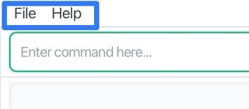
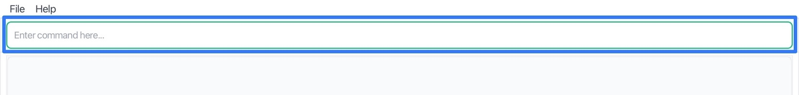
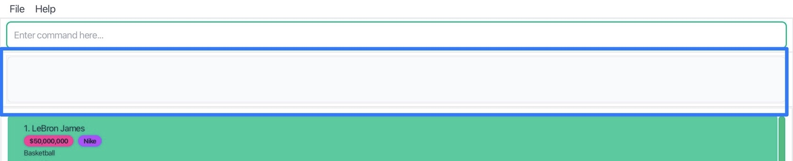
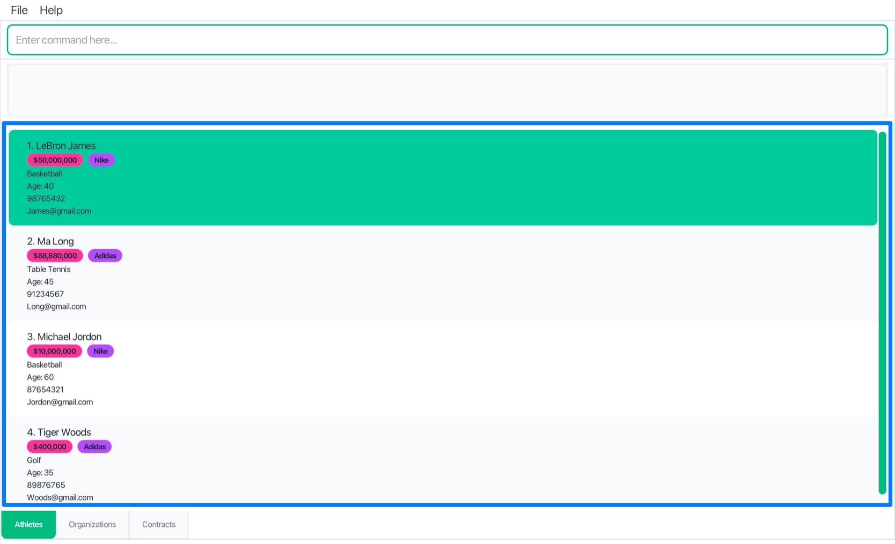
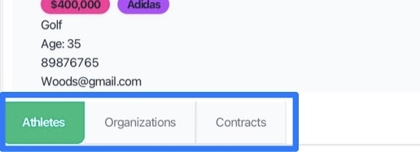

# User Guide

**playbook.io** is a platform that helps sports agents efficiently manage athletes, organizations, and contracts. It combines the speed of a Command Line Interface with the ease of a Graphical Interface, enabling agents to stay organized, build stronger relationships, and focus on closing deals.
<!-- * Table of Contents -->
<page-nav-print />

--------------------------------------------------------------------------------------------------------------------

## About This Guide

### Target Users

This guide is designed for **sports agents and talent managers** who:
- Manage multiple athletes across various sports
- Work with sports organizations, teams, and sponsors
- Handle contract negotiations and renewals
- Need to track relationships and opportunities efficiently
- Prefer fast, keyboard-driven workflows over mouse-heavy interfaces

### What You'll Need

**Prior Knowledge:**
- Basic computer literacy (file management, running applications)
- Familiarity with command-line interfaces is helpful but not required
- Understanding of sports industry terminology (contracts, agents, organizations)

**Technical Requirements:**
- Java 17 or higher installed on your computer
- 50MB of available storage space
- Any modern operating system (Windows, macOS, Linux)

### How to Use This Guide

- **New users**: Start with [Quick Start](#quick-start) for setup and basic usage
- **Existing users**: Jump to [Command Reference](#command-reference) for syntax details
- **Power users**: Check [Tips and Best Practices](#tips-and-best-practices) for advanced workflows

--------------------------------------------------------------------------------------------------------------------

## Quick Start

### Installation

1. **Check Java Version**
   
   Ensure you have Java `17` or above installed on your computer.
   ```
   java -version
   ```
   
   **Mac users:** Follow the setup guide [here](https://se-education.org/guides/tutorials/javaInstallationMac.html) to install the correct JDK version.  
   **Windows users:** Follow the setup guide [here](https://se-education.org/guides/tutorials/javaInstallationWindows.html) to install the correct JDK version.  
   **Linux users:** Follow the setup guide [here](https://se-education.org/guides/tutorials/javaInstallationLinux.html) to install the correct JDK version.
2. **Download playbook.io**
   
   Download the latest `.jar` file from the [playbook.io Releases](https://github.com/AY2526S1-CS2103T-F13-3/tp/releases) page.

3. **Set Up Home Folder**
   
   Copy the `.jar` file to the folder you want to use as the **home folder** for playbook.io. This is where your data files will be stored.

4. **Launch the Application**
   
   Open a terminal, navigate (`cd`) to that folder, and run:
   ```
   java -jar playbook.jar
   ```
   For example, if your `.jar` file is in the Downloads folder:
   ```
   cd Downloads
   java -jar playbook.jar
   ```

5. **First Look**
   
   The playbook.io interface should appear in a few seconds.
   
   

### Understanding the Interface

The playbook.io interface consists of five main areas, each highlighted with a blue box in the corresponding image:

1. **Menu Bar** (top): File and Help menus for application settings and documentation
   
2. **Command Box** (top area): Text input field where you type commands to interact with the application
   
3. **Result Pane** (top area): Displays the outcome of your commands, such as success messages, or error notifications
   
4. **Main Display Area** (center): Shows your data lists and command feedback messages
   
5. **Navigation Tabs** (bottom): Three tabs for switching between Athletes, Organizations, and Contracts views
   

**Navigation Tips:**
- Use **Cmd+1**, **Cmd+2**, **Cmd+3** (or **Ctrl+1**, **Ctrl+2**, **Ctrl+3** on Windows/Linux) to quickly switch between tabs
- Press **F1** for help or use the `help` command
- Use **Cmd+R** (or **Ctrl+R** on Windows/Linux) to refresh and clear any active search filters

### Your First Commands

Let's try some basic operations to get you started:

1. **Add an Athlete**
   ```
   add-a n/LeBron James s/Basketball a/40 p/98765432 e/james@example.com
   ```

2. **Add an Organization**
   ```
   add-o o/Nike p/98765432 e/john.doe@nike.com
   ```

3. **Search for Athletes**
   ```
   find -an LeBron
   ```

4. **Clear the Search**
   ```
   refresh
   ```

<div markdown="block" class="alert alert-info">

**💡 Tip:** All commands in playbook.io are designed to be fast to type. Use short flags like `-an` (athlete name) and `-on` (organization name) to quickly find what you need.

</div>

--------------------------------------------------------------------------------------------------------------------

## Core Features

### Managing Athletes

Athletes are the heart of your business. playbook.io makes it easy to track their information and see their contract relationships at a glance.

#### Adding Athletes

**Command:** `add-a n/NAME s/SPORT a/AGE p/PHONE e/EMAIL`

**Parameters:**
- `n/NAME`: Full name of the athlete (spaces allowed, case-insensitive; accepts alphabetic characters, hyphens, and apostrophes; must start with a letter)
- `s/SPORT`: Sport of the athlete (spaces allowed, case-insensitive; alphabetic characters only)
- `a/AGE`: Age of the athlete (positive integers only, ranging from 1 to 99)
- `p/PHONE`: Phone number of the athlete (8-digit Singapore phone number only)
- `e/EMAIL`: Email address of the athlete (case-insensitive; must follow standard email format)

**Examples:**
```
add-a n/Lebron James s/Basketball a/40 p/99876543 e/James@example.com
add-a n/Cristiano Ronaldo s/Football a/39 p/87654321 e/cr7@example.com
add-a n/Michael Jordan s/Basketball a/61 p/95551234 e/mj@example.com
```

**Expected Output:**
```
New athlete added: Lebron James; Sport: Basketball; Age: 40; Phone: 99876543; Email: James@example.com
```

<div markdown="block" class="alert alert-warning">

**⚠️ Important:** Athlete names and sports together must be unique. You cannot add two athletes with the exact same name and sport combination.

</div>

#### Deleting Athletes

**Command:** `delete-a n/NAME s/SPORT`

**Parameters:**
- `n/NAME`: Full name of the athlete to delete (spaces allowed, case-insensitive; accepts alphabetic characters, hyphens, and apostrophes; must start with a letter)
- `s/SPORT`: Sport of the athlete to delete (spaces allowed, case-insensitive; alphabetic characters only)

**Examples:**
```
delete-a n/Lebron James s/Basketball
delete-a n/Cristiano Ronaldo s/Football
delete-a n/Michael Jordan s/Basketball
```

**Expected Output:**
```
Deleted Athlete: Lebron James; Sport: Basketball; Age: 40; Phone: 99876543; Email: James@example.com
```

<div markdown="block" class="alert alert-warning">

**⚠️ Important:** You cannot delete an athlete if they have active contracts. You must delete all associated contracts first before removing the athlete.

</div>

### Managing Organizations

Organizations include teams, sponsors, agencies, and any entity that contracts with athletes.

#### Adding Organizations

**Command:** `add-o o/ORG_NAME p/PHONE e/EMAIL`

**Parameters:**
- `o/ORG_NAME`: Name of the organization (spaces allowed, case-insensitive; accepts alphabetic characters, hyphens, and apostrophes; must start with a letter)
- `p/PHONE`: Phone number of the organization (8-digit Singapore phone number only)
- `e/EMAIL`: Email address of the organization (case-insensitive; must follow standard email format)

**Examples:**
```
add-o o/Nike p/98765432 e/partnerships@nike.com
add-o o/Manchester United p/99998888 e/contracts@manutd.com
add-o o/IMG Academy p/88889999 e/talent@img.com
```

**Expected Output:**
```
New organization added: Nike; Phone: 98765432; Email: partnerships@nike.com
```

<div markdown="block" class="alert alert-warning">

**⚠️ Important:** Each organization name must be unique. You cannot add two organizations with the same name.

</div>

<div markdown="block" class="alert alert-info">

**💡 Tip:** Use descriptive names for organizations to easily distinguish between different types (teams, sponsors, agencies, etc.).

</div>


#### Deleting Organizations

**Command:** `delete-o o/ORG_NAME`

**Parameters:**
- `o/ORG_NAME`: Name of the organization to delete (spaces allowed, case-insensitive; accepts alphabetic characters, hyphens, and apostrophes; must start with a letter)

**Examples:**
```
delete-o o/Nike
delete-o o/Manchester United
delete-o o/IMG Academy
```

**Expected Output:**
```
Deleted Organization: Nike; Phone: 98765432; Email: partnerships@nike.com
```

<div markdown="block" class="alert alert-warning">

**⚠️ Important:** You cannot delete an organization if it has active contracts. You must delete all associated contracts first before removing the organization.

</div>

### Managing Contracts

Contracts link athletes with organizations and track the business relationships that matter most.

#### Adding Contracts

**Command:** `add-c n/NAME s/SPORT o/ORG sd/DDMMYYYY ed/DDMMYYYY am/AMOUNT`

**Parameters:**
- `n/NAME`: Athlete's full name (spaces allowed, case-insensitive; accepts alphabetic characters, hyphens, and apostrophes; must start with a letter) 
- `s/SPORT`: Athlete's sport (spaces allowed, case-insensitive; alphabetic characters only)
- `o/ORG_NAME`: Organization's name (spaces allowed, case-insensitive; accepts alphabetic characters, hyphens, and apostrophes; must start with a letter)
- `sd/DDMMYYYY`: Start date (must be in the DDMMYYYY format)
- `ed/DDMMYYYY`: End date (must be in the DDMMYYYY format)
- `am/AMOUNT`: Contract amount (positive integers only; no currency symbols or commas)

**Examples:**
```
add-c n/LeBron James s/Basketball o/Nike sd/01012024 ed/01012025 am/50000000
add-c n/Cristiano Ronaldo s/Football o/Manchester United sd/01072023 ed/31122025 am/50000000
add-c n/Michael Jordan s/Basketball o/IMG Academy sd/01012020 ed/31122024 am/5000000
```

**Expected Output:**
```
Contract created: Athlete: Lebron James; Sport: Basketball; Organization: Nike; Start: 01/01/2024; End: 01/01/2025; Amount: 50000000
```

<div markdown="block" class="alert alert-warning">

**⚠️ Important:** 
- Both the athlete and organization must exist before creating a contract
- Start date must be before or equal to end date
- Each contract must be unique. You cannot add two contracts with exactly the same details — athlete, organization, dates, and amount

</div>

#### Deleting Contracts

**Command:** `delete-c n/NAME s/SPORT o/ORG sd/DDMMYYYY ed/DDMMYYYY am/AMOUNT`

**Parameters:**
- `n/NAME`: Athlete's full name (spaces allowed, case-insensitive; accepts alphabetic characters, hyphens, and apostrophes; must start with a letter)
- `s/SPORT`: Athlete's sport (spaces allowed, case-insensitive; alphabetic characters only)
- `o/ORG_NAME`: Organization's name (spaces allowed, case-insensitive; accepts alphabetic characters, hyphens, and apostrophes; must start with a letter)
- `sd/DDMMYYYY`: Start date (must be in the DDMMYYYY format)
- `ed/DDMMYYYY`: End date (must be in the DDMMYYYY format)
- `am/AMOUNT`: Contract amount (positive integers only; no currency symbols or commas)

  **Examples:**
```
delete-c n/LeBron James s/Basketball o/Nike sd/01012024 ed/01012025 am/50000000
delete-c n/Cristiano Ronaldo s/Football o/Manchester United sd/01072023 ed/31122025 am/50000000
delete-c n/Michael Jordan s/Basketball o/IMG Academy sd/01012020 ed/31122024 am/5000000
```

**Expected Output:**
```
Deleted contract: Athlete: Lebron James; Sport: Basketball; Organization: Nike; Start: 01/01/2024; End: 01/01/2025; Amount: 50000000
```

### Finding & Filtering Data

The search functionality uses **fuzzy matching** to help you find what you're looking for, even with typos or partial names.

#### Search Command

**Command:** `find -[FLAG] KEYWORD`

**Available Search Types:**

| Flag | Searches | Example               |
|------|----------|-----------------------|
| `-an` | Athlete names | `find -an LeBron`     |
| `-as` | Athlete sports | `find -as Basketball` |
| `-on` | Organization names | `find -on Nike`       |
| `-ca` | Contracts by athlete name | `find -ca LeBron`     |
| `-cs` | Contracts by sport | `find -cs Basketball` |
| `-co` | Contracts by organization | `find -co Nike`       |

**Examples:**
```
find -an James          # Find athletes with names like "James"
find -as Basketball     # Find athletes with sports like "Basketball"
find -on Nike           # Find organizations with names like "Nike"
find -ca LeBron         # Find contracts with athletes named like "LeBron"
find -cs Basketball     # Find all contracts athletes' sports named like "Basketball"
find -co Nike           # Find contracts with organizations like "Nike"
```

**Expected Output for `find -an James`:**
```
Showing 1 athletes closely matching "James".
Use the "refresh" command to show all data again.
```

<div markdown="block" class="alert alert-info">

**💡 Fuzzy Search Features:**
- **Exact matches**: "Nike" will find "Nike" instantly
- **Substring matches**: "Man" will find "Manchester United"  
- **Typo tolerance**: "Messy" will find "Messi" (1-2 character differences allowed)
- **Case insensitive**: "NIKE" and "nike" both work

</div>

#### Clearing Search Results

**Command:** `refresh`

Use this command to clear any active search filters and return to viewing all data.

**Keyboard Shortcut:** **Cmd+R** (macOS) or **Ctrl+R** (Windows/Linux)

**Expected Output:**
```
All filters cleared. Showing all athletes, organizations, and contracts.
```
<div markdown="block" class="alert alert-info">

**💡 Tip:**
You can refresh the display anytime using **Cmd+R** (macOS) or **Ctrl+R** (Windows/Linux).

</div>

### Application Controls

#### Getting Help

**Command:** `help`

Opens the help window with quick reference information and links to documentation.

**Keyboard Shortcut:** **F1**

**Expected Output:**
```
Opened help window.
```

#### Exiting the Application

**Command:** `exit`

Safely closes playbook.io and saves all your data.

**Expected Output:**
```
Exiting Address Book as requested ...
```

<div markdown="block" class="alert alert-info">

**💡 Tip:** Your data is automatically saved after every command, so you never have to worry about losing information.

</div>

--------------------------------------------------------------------------------------------------------------------

## Command Reference

### Quick Syntax Guide

| Command | Syntax                                                 | Description |
|---------|--------------------------------------------------------|-------------|
| `add-a` | `add-a n/NAME s/SPORT a/AGE p/PHONE e/EMAIL`           | Add new athlete |
| `delete-a` | `delete-a n/NAME s/SPORT`                              | Delete athlete |
| `add-o` | `add-o o/ORG_NAME p/PHONE e/EMAIL`                     | Add new organization |
| `delete-o` | `delete-o o/ORG_NAME`                                  | Delete organization |
| `add-c` | `add-c n/NAME s/SPORT o/ORG sd/DATE ed/DATE am/AMOUNT` | Add new contract |
| `delete-c` | `delete-c n/NAME s/SPORT o/ORG sd/DATE ed/DATE am/AMOUNT`       | Delete contract |
| `find` | `find -[an\|as\|on\|ca\|co\|cs] KEYWORD`               | Search/filter data |
| `refresh` | `refresh`                                              | Clear all filters |
| `help` | `help`                                                 | Open help window |
| `exit` | `exit`                                                 | Close application |

### Parameter Details

**Common Parameters:**
- `NAME`: Full Name (spaces allowed, case-insensitive; accepts alphabetic characters, hyphens, and apostrophes; must start with a letter)
- `SPORT`: Sport (spaces allowed, case-insensitive; alphabetic characters only)
- `AGE`: Age (positive integers only, ranging from 1 to 99)
- `ORG_NAME`: Organization name (spaces allowed, case-insensitive; accepts alphabetic characters, hyphens, and apostrophes; must start with a letter)
- `PHONE`: Phone number (8-digit Singapore phone number only)
- `EMAIL`: Email address (case-insensitive; must follow standard email format)
- `DATE`: Date (must be in the DDMMYYYY format)
- `AMOUNT`: Amount (positive integers only; no currency symbols or commas)

### Keyboard Shortcuts

| Shortcut | Action | Description |
|----------|--------|-------------|
| **F1** | Help | Open help window |
| **Cmd+R** / **Ctrl+R** | Refresh | Clear all active filters |
| **Cmd+1** / **Ctrl+1** | Athletes Tab | Switch to Athletes view |
| **Cmd+2** / **Ctrl+2** | Organizations Tab | Switch to Organizations view |
| **Cmd+3** / **Ctrl+3** | Contracts Tab | Switch to Contracts view |

--------------------------------------------------------------------------------------------------------------------

## Tips and Best Practices

### Effective Workflows

**Daily Management:**
1. Start each day with `refresh` to see all your data
2. Use `find -an [name]` to quickly locate specific athletes
3. Check contract expiry dates regularly with `find -cs [sport]`
4. Keep contact information updated for all entities

**Contract Negotiation Season:**
1. Use `find -ca [athlete]` to see all contracts for an athlete
2. Cross-reference with `find -co [organization]` to see organization's other deals
3. Track contract amounts and dates systematically
4. Add new contracts immediately after signing

**Data Organization:**
- Use consistent naming conventions (e.g., "FC Barcelona" vs "Barcelona FC")
- Include full legal names for organizations
- Keep email and phone information current
- Group related contracts by using similar start/end date patterns

### Common Pitfalls & Solutions

**Problem:** "Athlete not found" when adding contracts  
**Solution:** Use `find -an [name]` first to verify the exact name spelling

**Problem:** Too many search results  
**Solution:** Use more specific keywords or combine with tab switching

**Problem:** Slow performance with large datasets  
**Solution:** Use search filters regularly instead of browsing all data

**Problem:** App behaves unexpectedly after deleting files  
**Solution:** Never delete individual JSON files in the `data` folder.  
If you need to reset your data, delete the entire folder instead.

--------------------------------------------------------------------------------------------------------------------

## Troubleshooting and FAQ

### Display and Window Issues

**Problem:** Application window opens off-screen after disconnecting a monitor  
**Cause:** The application remembers its last window position from preferences.json. If the app was last open on a secondary monitor and that monitor is disconnected, the window tries to open in the same (now nonexistent) location  
**Solution:** Delete the `preferences.json` file before launching the app again to reset window position

### Common Error Messages

**"Error: Unknown command"**
- Check spelling of command name
- Ensure you're using the correct flags (e.g., `-an` not `-name`)
- See [Command Reference](#command-reference) for exact syntax

**"Invalid date format"**
- Use DDMMYYYY format only (e.g., 25122024)
- No spaces, dashes, or slashes in dates
- Ensure day/month values are valid (01-31 for days, 01-12 for months)

**"Athlete/Organization/Contract not found"**
- Use `find` commands to locate the exact name
- Check for typos or extra spaces
- Names are case-sensitive and must match exactly

**"Athlete/Organization/Contract already exists"**
- Athlete name + sport combinations must be unique
- Organization names must be unique
- Contracts must have unique parameter combinations
- Try slightly different name variations if needed

### Performance Issues

**Large datasets (1000+ entries):**
- Use search filters instead of browsing all data
- Close and restart the application weekly
- Consider archiving old contracts to separate files

**Slow startup:**
- Check available disk space (need 50MB minimum)
- Ensure Java version is 17 or higher
- Try moving to a different folder location

### Getting More Help

**Additional Resources:**
- [GitHub Repository](https://github.com/AY2526S1-CS2103T-F13-3/tp) for technical issues
- [Developer Guide](https://ay2526s1-cs2103t-f13-3.github.io/tp/DeveloperGuide.html) for advanced customization
- Community forums for user tips and tricks

**Reporting Bugs:**
1. Document the exact command that caused the issue
2. Note any error messages displayed
3. Include your operating system and Java version
4. Submit via GitHub Issues with detailed description

--------------------------------------------------------------------------------------------------------------------

## Appendix

### Glossary

**Athlete**: An individual sports performer managed by the agent, with contact details and sport specialization.

**Contract**: A business agreement between an athlete and organization, including financial terms and duration.

**Fuzzy Search**: A search method that finds results even with typos or partial matches, using intelligent algorithms.

**Organization**: Any business entity that contracts with athletes - teams, sponsors, agencies, brands, etc.

**Sports Agent**: A professional who represents athletes in contract negotiations and career management.

### Technical Specifications

**System Requirements:**
- **Java Version**: 17 or higher (OpenJDK or Oracle JDK)
- **Memory**: 512MB RAM minimum, 1GB recommended
- **Storage**: 50MB available space for application and data
- **Display**: 1024x768 minimum resolution

**Supported Platforms:**
- Windows 10/11
- macOS 10.14 (Mojave) or later
- Linux (Ubuntu 18.04+, CentOS 7+, or equivalent)

**Data Storage:**
- All data stored locally in JSON format
- No internet connection required for operation
- Data files are human-readable and portable

### Contact Information

**Development Team:**
- Project maintained by CS2103T-F13-3 team
- GitHub: [AY2526S1-CS2103T-F13-3/tp](https://github.com/AY2526S1-CS2103T-F13-3/tp)

**Support:**
- Technical issues: Submit GitHub Issues
- Feature requests: Use GitHub Discussions
- General questions: Consult the FAQ section in the documentation, otherwise contact us with GitHub Discussions!

**Version Information:**
- Current Version: 1.4
- Last Updated: November 2024
- License: MIT License

---

*Thank you for using playbook.io! We're committed to helping sports agents succeed in managing their athletes and growing their business.*
